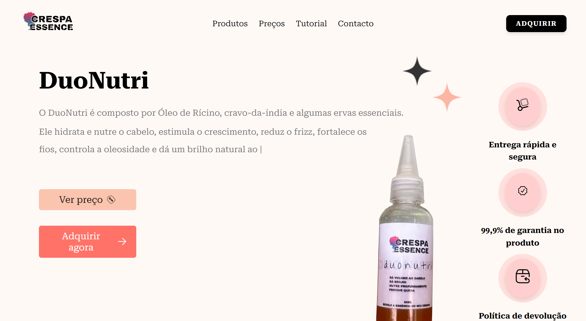
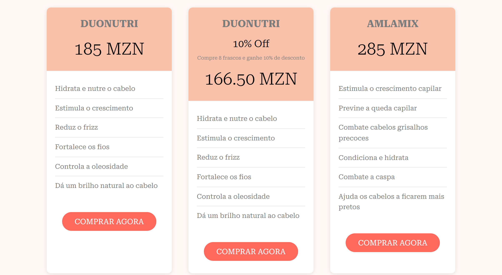

# Crespa Essence - Landing Page

Esta é uma simples landing page para vender produtos cosméticos a partir do WhatsApp.

### Funcionalidades

- **Conctato via WhatsApp:** Integração direta para facilitar a comunicação com os clientes.
- **Personalização:** Código fonte facilmente editável para adequação às suas necessidades.
- **Design Responsivo:** Adequado para diversos dispositivos e tamanhos de tela.

### Como Utilizar

Você pode baixar, editar ou alterar qualquer parte deste código para fins pessoais ou comerciais, desde que mantenha este README, o cabeçalho no script ou o crédito no rodapé (footer), atribuindo os devidos créditos ao autor.

#### Requisitos

- Conhecimento básico de HTML, CSS e JavaScript para personalizações mínimas.
- Conhecimento moderado de programação para adaptações mais complexas.

#### Personalização

Como a página é estática, a personalização requer ajustes mínimos no código fonte, incluindo:

- **Índice (index.html)**
- **Estilo (style.css)**
- **Script Principal (script.js)**

As partes do código que são mais facilmente mutáveis estão comentadas como:

```javascript
// Easily Changeable Variables and Objs
```

Para configurar uma página de erro personalizada, edite o 404.html (certifique-se de que o arquivo está na raiz do projecto), e configure a página para o provedor de hospedagem que voce esta usando, exemplo de alguns dos provedores mais comuns:

##### Netlify

1. Crie um arquivo `_redirects` na raiz com a seguinte configuração:

   ```
   /*  /404.html  404
   ```

##### Vercel

1. Adicione um arquivo `vercel.json` na raiz com a seguinte configuração:

   ```json
   {
     "routes": [
       {
         "src": "/(.*)",
         "status": 404,
         "dest": "/404.html"
       }
     ]
   }
   ```

##### Firebase Hosting

1. Adicione uma entrada para a página de erro no seu arquivo `firebase.json`:

   ```json
   {
     "hosting": {
       "public": "public",
       "rewrites": [
         {
           "source": "**",
           "destination": "/404.html"
         }
       ]
     }
   }
   ```

##### SEO

Edite também o arquivo `sitemap.xml`, inserindo a URL e as datas de modificações correctas, isso ajuda a permitir melhor indexação do site nos motores de busca. Confira também se o arquivo `robots.txt` está configurado correctamente.

### Autor

Por favor, não remova as informações do autor. Este projeto levou 27h para ser concluído.

- **Programado por:** Arlindo Abdul
- **Email:** [admin@tudocomlizzyman.com](mailto:admin@tudocomlizzyman.com)
- **Repositório:** [https://github.com/Lizzyman04/Crespa-Essence](https://github.com/Lizzyman04/Crespa-Essence)
- **Website**: [Crespa Essence | Revele a essência do seu crespo](https://lizzyman04.github.io/Crespa-Essence)

Este projeto está licenciado sob a Licença MIT. Veja o arquivo [LICENSE](LICENSE) para mais detalhes.

## Imagens e Componentes

Aqui estão algumas das imagens e componentes disponíveis no projeto:

Ecrã principal com o efeito typewriter e texto eraser, sobe a transição dos produtos:



Relação dos preços com botões com eventos singulares:



O slider de tutorias de como usar os produtos vendidos (visão mobile):


Au revoir 👋